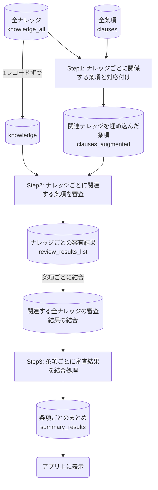

# 契約審査アプリのPrompt説明

## 審査フロー



<div style="page-break-after: always;"></div>

---

## Step1: ナレッジごとに関係する条項と対応付け

### clauses_augmented = amatching_clause_and_knowledge( knowledge_all, clauses )


```
clauses = [
        {
            "clause_number": "前文",
            "clause": "武蔵精密工業株式会社（以下「甲」という。）と株式会社AAA（以下「乙」という。）とは、甲と乙の共同開発の可能性検討（以下「本業務」という。）を目的として、互いに開示する情報の秘密保持に関し、以下の通り定める。",
            "knowledge_id": []
        },
        {
            "clause_number": "1",
            "clause": "第1条\n（秘密情報）\n本契約において｢秘密情報｣とは、･･･開示後速やかに通知するものとする。",
            "knowledge_id": []
        },...以降も文書全体がつづく...]
```

```
knowledge_all = [
    {
        "id": "362d7a0d-5c29-4349-be4c-58182eecd502",
        "knowledge_number": 1,
        "contract_type": "秘密保持",
        "target_clause": "契約の対象業務を特定する記載がある条文または前文",
        "knowledge_title": "前文・目的条項の明確性",
        "review_points": "- 前文で契約の目的をわかりやすく記載し、複雑な場合は目的条項を独立させる。\n- 受領当事者の要求を満たすために、秘密情報の開示・使用範囲が目的定義の範囲内に入っているか確認する。",
        "action_plan": "- 目的の表現が曖昧でないか、関係者が一目で理解できるかを確認する。\n- 必要に応じて範囲を拡大または調整し、当初想定した利用目的が達成できるように修正する。",
        "clause_sample": "武蔵精密工業株式会社（以下「甲」という。）と株式会社AAA（以下「乙」という。）とは、甲と乙の〇〇製品の共同開発の可能性検討（以下「本業務」という。）を目的として、互いに開示する情報の秘密保持に関し、以下の通り定める。",
    {
        "id": "2b914516-a814-45ae-a525-525b216e97b2",
        "knowledge_number": 2,
        "contract_type": "秘密保持",
        "target_clause": "契約の対象業務を特定する記載がある条文または前文",
        "knowledge_title": "受領当事者にとっての目的範囲の適切性",
        "review_points": "受領当事者にとっての目的範囲の適切性",
        "action_plan": "- 受領当事者の要求を満たすために、秘密情報の開示・使用範囲が目的定義の範囲内に入っているか確認する。\n- 必要に応じて範囲を拡大または調整し、当初想定した利用目的が達成できるように修正する。",
        "clause_sample": "武蔵精密工業株式会社（以下「甲」という。）と株式会社AAA（以下「乙」という。）とは、甲と乙の〇〇製品の共同開発の可能性検討（以下「本業務」という。）を目的として、互いに開示する情報の秘密保持に関し、以下の通り定める。",
    },...以降もN個ずつつづく...]
```

> LLM処理で精度が落ちないように、契約書案の全文に対して、ナレッジをN個ずつで処理し、あとで結果を結合している。


**Prompt**
```
あなたは日本語の契約書に精通したリーガルアシスタントです。
タスク：各 knowledge.target_clause（審査知見が対象とする条項の条件）に合致する契約条項（clause_number）を、提供された clauses から特定してください。
出力は **厳格なJSONのみ** で返します。余計な説明、コードブロック、注釈は一切含めません。

要件:
- 出力は配列。各要素は {{"knowledge_id": str, "clause_number": [str, ...]}} の形。
- 条項が特定できない／確度が低い場合は "clause_number": [] とする。
- "clause_number" は入力の clauses 内の "clause_number"（文字列）で返す。整数にはしない。
- 解釈は「条項の機能」ベース（例：定義条項、目的条項、開示義務条項 等）。単語一致のみで判断しない。
- 過剰な割当は禁止。曖昧なら空配列を選ぶ。
- JSON以外を一切出力しない。

与えられるデータ:
  knowledge_all: {knowledge_id, target_clause}
  clauses: {clause_number, clause}

出力フォーマット（厳格に遵守）: [
    {{"knowledge_id": "xxx-xxx", "clause_number": ["1", "2"]}},
    {{"knowledge_id": "yyy-yyy", "clause_number": []}}
]
```

**出力結果**
```
clauses_augmented = [
        {
            "clause_number": "前文",
            "clause": "武蔵精密工業株式会社（以下「甲」という。）と株式会社AAA（以下「乙」という。）とは、甲と乙の共同開発の可能性検討（以下「本業務」という。）を目的として、互いに開示する情報の秘密保持に関し、以下の通り定める。",
            "knowledge_id": [
                "362d7a0d-5c29-4349-be4c-58182eecd502",
                "2b914516-a814-45ae-a525-525b216e97b2",
                "1ed131a5-3abc-4cfc-922c-f3536b4bad29"
            ]
        },
        {
            "clause_number": "1",
            "clause": "第1条\n（秘密情報）\n本契約において｢秘密情報｣とは、･･･開示後速やかに通知するものとする。",
            "knowledge_id": [
                "dadcfc4e-94da-4e2a-8dcf-bc5ae6172c5d",
                "ffd5e1e9-fcc5-43d9-9680-4f41eeaf1733",
                "d77e04af-f01c-4521-bb44-1d26851bdaa9"
            ]
        }]
```

<div style="page-break-after: always;"></div>

---

## Step2: ナレッジごとに関連条項を審査

### review_results_list = run_batch_reviews(clauses, knowledge)

```
clauses = [{
	"clause_number": "7", 
	"clause": "第7条\n（期間）\n本契約の有効期間は、2024年4月1日 から2025年3月31日までとする。但し、上記期間は、各当事者の書面による合意により、変更す ることができる。"}, 
	{
	"clause_number": "8", 
	"clause": "第8条\n（残存条項）第1条\n乃至第6条\n、第9条\n及び第10条\nの規定は、本契約の終了後も3年間効力を有するものとする。"
}]

knowledge = [{
	"id": "27f85965-3e5c-4486-a7bf-2ad8da8246d2", 
	"target_clause": "以下(1), (2)の両方　(1) 契約の有効期間を定める条項、(2) 契約終了後の効力発揮について述べる条項", 
	"knowledge_title": "秘密保持義務等の残存期間の妥当性", 
    "review_points": "秘密保持義務等の残存期間の妥当性", 
	"action_plan": "契約終了後の秘密保持義務・目的外使用禁止義務等の存続期 間が、情報の性質・技術分野の陳腐化スピードを踏まえた適切期間（一般的に2～5年、必要に応じて永久保持も検討）に設定されているか確認し、必要に応じて調整を提案する", 
	"clause_sample": "第７条（期間）\n　　本契約の有効期間は、2024年4月1日から2025年3月31日までとする。但し、上記期間は、各当事者の書面による合意により、変更することができる。\n第８条（残存条項）\n　　第１条乃至第６条、第９条及び第１０条の規定は、本契約の終了後も３年間効力を有するものとする。"}]
```

**Prompt**
```
あなたは契約審査の専門家です。以下の審査対象データと審査知見をもとに、各条項ごとに懸念点(concern)と修正条文(amendment_clause)を出力してください。
懸念点(concern)は、端的な箇条書きで提供してください。
修正した条文(amendment_clause)は、要変更箇所を明示し、端的に示してください。
審査の根拠とする knowledge_ids を必ず提示し、提供する審査知見以外を利用した審査は絶対にしないでください。
審査の結果懸念がない場合は、"concern" および "amendment_clause" を null で出力してください。

【出力形式】
必ず以下の厳格なJSON配列形式で出力してください。
[
	{{
	    "clause_number": <条項番号（文字列）>,
        "concern": <懸念点コメント> or null,'
        "amendment_clause": <修正条文> or null,'
        "knowledge_ids": [<ナレッジIDの配列>]'
  }}, ...
]

【審査対象データ】
	clauses: ナレッジひとつずつに関連する条項を全てまとめたデータ（1のナレッジで複数条項が対応する場合はすべての条項データが含まれる）

【審査知見（knowledge）】
	knowledge: ひとつずつのナレッジデータ

審査は提供する審査知見以外を絶対に利用しないでください。
```

処理はナレッジごとに行うが、出力は条項ごととしている。
審査した結果、懸念が無いなら "concern": null となっている。

```
review_results_list = {
    "前文": [
        {
            "clause_number": "前文",
            "concern": ["契約の対象業務（目的範囲）が具体的かつ限定的に記載されていないため、開示情報が想定外の用途に使われるリスクがある。"],
            "amendment_clause": "武蔵精密工業株式会社（以下「甲」という。）と株式会社AAA（以下「乙」という。）とは、甲と乙の〇〇製品の共同開発の可能性検討（以下「本業務」という。）を目的として、互いに開示する情報の秘密保持に関し、以下の通り定める。",
            "knowledge_ids": ["1ed131a5-3abc-4cfc-922c-f3536b4bad29"]
        },
        {
            "clause_number": "前文",
            "concern": [
                "契約の目的が『互いに開示する情報の秘密保持』としか記載されておらず、具体的な業務や目的が明確でない。",
                "秘密情報の開示・使用範囲が目的定義の範囲内に入っているか不明確。"
            ],
            "amendment_clause": "武蔵精密工業株式会社（以下「甲」という。）と株式会社AAA（以下「乙」という。）とは、甲と乙の〇〇製品の共同開発の可能性検討（以下「本業務」という。）を目的として、互いに開示する情報の秘密保持に関し、以下の通り定める。",
            "knowledge_ids": ["362d7a0d-5c29-4349-be4c-58182eecd502"]
        },
        {
            "clause_number": "前文",
            "concern": [
                "契約の対象業務（目的）が明確に記載されていないため、秘密情報の開示・使用範囲が不明確となり、受領当事者の要求を満たす目的範囲の適切性が担保されていない。"
            ],
            "amendment_clause": "武蔵精密工業株式会社（以下「甲」という。）と株式会社AAA（以下「乙」という。）とは、甲と乙の〇〇製品の共同開発の可能性検討（以下「本業務」という。）を目的として、互いに開示する情報の秘密保持に関し、以下の通り定める。",
            "knowledge_ids": [
                "2b914516-a814-45ae-a525-525b216e97b2"
            ]
        }
    ],
    "7": [
        {
            "clause_number": "7",
            "concern": null,
            "amendment_clause": null,
            "knowledge_ids": [
                "1ed131a5-3abc-4cfc-922c-f3536b4bad29"
            ]
        },
        {
            "clause_number": "7",
            "concern": null,
            "amendment_clause": null,
            "knowledge_ids": [
                "27f85965-3e5c-4486-a7bf-2ad8da8246d2"
            ]
        }
    ],
    "1": [
        {
            "clause_number": "1",
            "concern": [
                "書面・図面等の有形物による開示情報に秘密である旨の明示的表示義務が規定されていない。",
                "電子メール等の電気通信手段による開示情報に秘密である旨の表示義務が規定されていない。",
                "口頭又は視覚的手段による開示情報について、開示時の表明のみであり、開示後30日以内の書面化義務が規定されていない。",
                "本業務のために提供・製作した物品や試験等により得られた情報について、秘密である旨の書面による明示義務が規定されていない。",
                "開示当事者の秘密情報に基づいて創出された情報および本件目的の成果が秘密情報とみなされる旨の規定がない。"
            ],
            "amendment_clause": "第1条（秘密情報）\n本契約において｢秘密情報｣とは、本契約締結の事実及び内容、本契約に基づき秘密情報を開示する当事者（以下「開示者」という。）が秘密情報を受領する当事者（以下「受領者」という。）に開示した技術情報、並びに本業務の過程で知り得た他の当事者の業務上及び技術上の情報のうち、次の各号に該当するものをいう。\n（１）書面、図面、電子媒体及びその他有形物による開示であって、当該書面又は媒体上に秘密である旨の表示をなしたもの。\n（２）電子メール等の電気通信手段により開示された情報であって、当該情報に秘密である旨の表示をなしたもの。\n（３）口頭又は視覚的手段によって開示された情報であって、開示の際に秘密である旨を表明し、かつ、開示の日より３０日以内に当該情報の概要及び当該情報が秘密である旨を明示した書面が提供されたもの。\n（４）本業務のために開示者が受領者に提供した物品及び本業務のために製作した物品で当該各物品が秘密である旨を明示した書面が提供された物品、並びに、本業務のために行った試験等により得られた情報で当該情報が秘密である旨を明示した書面が提供された情報。\n（５）開示当事者の秘密情報に基づいて創出された情報および本件目的の成果は、秘密情報とみなす。\n（６）その他、各当事者が別途協議の上、秘密である旨を書面により確認した情報。",
            "knowledge_ids": [
                "ffd5e1e9-fcc5-43d9-9680-4f41eeaf1733"
            ]
        },
        {
            "clause_number": "1",
            "concern": [
                "秘密情報の定義において、開示当事者の秘密情報に基づき創出された成果や新情報、契約締結前に開示された情報の扱いが明確でない。",
                "口頭・視覚的開示情報について、事後の書面確認プロセス（例：30日以内の書面提供）が規定されていない。",
                "本業務のために製作した物品や試験等により得られた情報について、秘密である旨の書面確認プロセスが不明確。"
            ],
            "amendment_clause": "第1条（秘密情報）\n本契約において｢秘密情報｣とは、本契約締結の事実及び内容、本契約に基づき秘密情報を開示する当事者（以下「開示者」という。）が秘密情報を受領する当事者（以下「受領者」という。）に開示した技術情報、並びに本業務の過程で知り得た他の当事者の業務上及び技術上の情報のうち、次の各号に該当するものをいう。\n（1）書面、図面、電子媒体及びその他有形物による開示であって、当該書面又は媒体上に秘密である旨の表示をなしたもの。\n（2）電子メール等の電気通信手段により開示された情報であって、当該情報に秘密である旨の表示をなしたもの。\n（3）口頭又は視覚的手段によって開示された情報であって、開示の際に秘密である旨を表明し、かつ、開示の日より30日以内に当該情報の概要及び当該情報が秘密である旨を明示した書面が提供されたもの。\n（4）本業務のために開示者が受領者に提供した物品及び本業務のために製作した物品で当該各物品が秘密である旨を明示した書面が提供された物品、並びに、本業務のために行った試験等により得られた情報で当該情報が秘密である旨を明示した書面が提供された情報。\n（5）開示当事者の秘密情報に基づいて創出された情報および本件目的の成果は、秘密情報とみなす。\n（6）その他、各当事者が別途協議の上、秘密である旨を書面により確認した情報。",
            "knowledge_ids": ["d77e04af-f01c-4521-bb44-1d26851bdaa9"]
        },
        {
            "clause_number": "1",
            "concern": [
                "秘密情報の定義において、書面・電子媒体・電気通信手段による開示情報に『秘密である旨の表示』要件が明記されていない。",
                "口頭・視覚的開示情報について、開示後に書面で秘密である旨を通知する要件がないため、認定範囲が曖昧となる可能性がある。",
                "本業務の成果物や秘密情報に基づいて創出された情報が秘密情報に含まれる旨の明記がない。",
                "秘密情報の認定手続き（例：開示後30日以内の書面通知等）が不足している。"
            ],
            "amendment_clause": "第1条（秘密情報）\n本契約において｢秘密情報｣とは、本契約締結の事実及び内容、本契約に基づき秘密情報を開示する当事者（以下「開示者」という。）が秘密情報を受領する当事者（以下「受領者」という。）に開示した技術情報、並びに本業務の過程で知り得た他の当事者の業務上及び技術上の情報のうち、次の各号に該当するものをいう。\n（1）書面、図面、電子媒体及びその他有形物による開示であって、当該書面又は媒体上に秘密である旨の表示をなしたもの。\n（2）電子メール等の電気通信手段により開示された情報であって、当該情報に秘密である旨の表示をなしたもの。\n（3）口頭又は視覚的手段によって開示された情報であって、開示の際に秘密である旨を表明し、かつ、開示の日より30日以内に当該情報の概要及び当該情報が秘密である旨を明示した書面が提供されたもの。\n（4）本業務のために開示者が受領者に提供した物品及び本業務のために製作した物品で当該各物品が秘密である旨を明示した書面が提供された物品、並びに、本業務のために行った試験等により得られた情報で当該情報が秘密である旨を明示した書面が提供された情報。\n（5）開示当事者の秘密情報に基づいて創出された情報および本件目的の成果は、秘密情報とみなす。\n（6）その他、各当事者が別途協議の上、秘密である旨を書面により確認した情報。",
            "knowledge_ids": ["dadcfc4e-94da-4e2a-8dcf-bc5ae6172c5d"]
        }
    ],
    "8": [
        {
            "clause_number": "8",
            "concern": null,
            "amendment_clause": null,
            "knowledge_ids": ["27f85965-3e5c-4486-a7bf-2ad8da8246d2"]
        }
    ]
}
```

<div style="page-break-after: always;"></div>

---

## Step3: 条項ごとに審査結果を結合処理

### summary_results = run_batch_summaries(clause_number, concerns, amendments)

```
clause_number: 前文

concerns: [
	["契約の目的が具体的かつ限定的に記載されていないため、開示情報の使用範囲が不明確。", "目的範囲の制限がないため、想定外の用途で情報が使用されるリスクがある。"], 
	["契約の目的が明確に記載されていないため、秘密保持の範囲や使用目的が不明確。", "関係者が契約の対象業務を一目で理解できない可能性がある。"], 
    ["契約の対象業務や目的が明示されていないため、秘密情報の開示・使用範囲が不明確である。", "受領当事者の利用目的が特定されていないため、目的範囲の適切性が担保されていない。"]
]
amendments: [
    "武蔵精密工業株式会社（以下「甲」という。）と株式会社AAA（以下「乙」という。）とは、甲と乙の〇〇製品の共同開発の可能性検討（以下「本業務」という。）を目的として、互いに開示する情報の秘密保持に関し、以下の通り定める。", 
    "武蔵精密工業株式会社（以下「甲」という。）と株式会社AAA（以下「乙」という。）とは、甲と乙の〇〇製品の共同開発の可能性検討（以下「本業務」という。）を目的として、互いに開示する情報の秘密保持に関し、以下の通り定める。", 
    "武蔵精密工業株式会社（以下「甲」という。）と株式会社AAA（以下「乙」という。）とは、甲と乙の〇〇製品の共同開発の可能性検討（以下「本業務」という。）を目的として、互いに開示する情報の秘密保持に関し、以下の通り定める。"]
```

**Ptompt**
```
あなたは契約審査の専門家です。以下の複数の指摘事項・修正条項案を統合し、重複や類似内容をまとめて簡潔にしてください。
【出力形式】
{"concern": <要約した懸念点>, "amendment_clause": <統合した修正条項案>}

【条項番号】clause_number
【指摘事項一覧】concerns
【修正文案一覧】amendments
```

```
summary_results = [
	{
        "clause_number": "前文",
        "concern": "契約の目的および対象業務が具体的かつ明確に記載されておらず、秘密情報の使用範囲や保持範囲が不明確であるため、情報の不適切な使用リスクがある。",
        "amendment_clause": "武蔵精密工業株式会社（以下「甲」という。）と株式会社AAA（以下「乙」という。）とは、甲と乙の〇〇製品の共同開発の可能性検討（以下「本業務」という。）を目的として、互いに開示する情報の秘密保持に関し、以下の通り定める。",
        "knowledge_ids": [
            "362d7a0d-5c29-4349-be4c-58182eecd502",
            "2b914516-a814-45ae-a525-525b216e97b2",
            "1ed131a5-3abc-4cfc-922c-f3536b4bad29"
        ]
    },
    {
        "clause_number": "1",
        "concern": "秘密情報の定義が不明確で、特に口頭や視覚的手段による開示時の秘密保持表明とその後の書面化（30日以内の書面提供）が規定されていないこと、本業務のために提供・製作した物品や試験等で得られた情報の秘密情報該当が明示されていないこと、開示当事者の秘密情報に基づく創出情報や本件目的の成果の秘密情報該当が明記されていないこと、及び契約締結前に開示された情報の取り扱いが不明確である点。",
        "amendment_clause": "第1条（秘密情報）\n本契約において「秘密情報」とは、本契約締結の事実及び内容、本契約に基づき秘密情報を開示する当事者（以下「開示者」という。）が秘密情報を受領する当事者（以下「受領者」という。）に開示した技術情報、並びに本業務の過程で知り得た他の当事者の業務上及び技術上の情報のうち、次の各号に該当するものをいう。\n(1) 書面、図面、電子媒体及びその他有形物によって開示された情報であって、当該書面又は媒体上に秘密である旨の表示をなしたもの。\n(2) 電子メール等の電気通信手段により開示された情報であって、当該情報に秘密である旨の表示をなしたもの。\n(3) 口頭又は視覚的手段によって開示された情報であって、開示の際に秘密である旨を表明し、かつ開示の日より30日以内に当該情報の概要及び秘密である旨を明示した書面が提供されたもの。受領者はこれを遵守するものとする。\n(4) 本業務のために開示者が受領者に提供した物品及び本業務のために製作した物品で、当該各物品が秘密である旨を明示した書面が提供された物品、並びに本業務のために行った試験等により得られた情報で当該情報が秘密である旨を明示した書面が提供された情報。\n(5) 開示当事者の秘密情報に基づいて創出された情報及び本件目的の成果。\n(6) 本契約締結前に開示された情報であって、秘密である旨を明示したもの。\n(7) その他、各当事者が別途協議の上、秘密である旨を書面により確認した情報。",
        "knowledge_ids": [
            "dadcfc4e-94da-4e2a-8dcf-bc5ae6172c5d",
            "ffd5e1e9-fcc5-43d9-9680-4f41eeaf1733",
            "d77e04af-f01c-4521-bb44-1d26851bdaa9"
        ]
    }
    {
        "clause_number": "2",
        "concern": "",
        "amendment_clause": "",
        "knowledge_ids": []
    },...条項の数だけ続く...]
```

**アプリ上の出力**
- 条項
- 修正条項: amendment_clause
- 懸念事項: concern
- ナレッジ: knowledge_idsからデータを検索して表示
