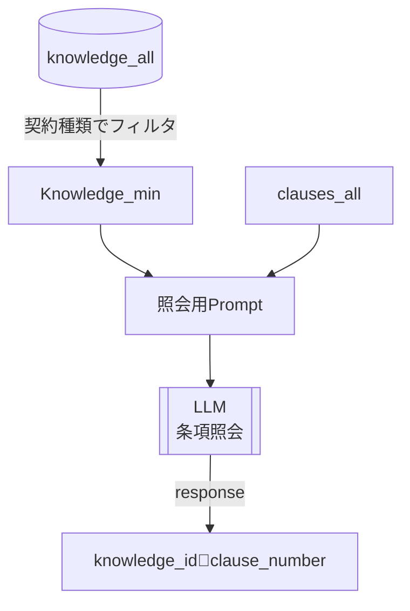
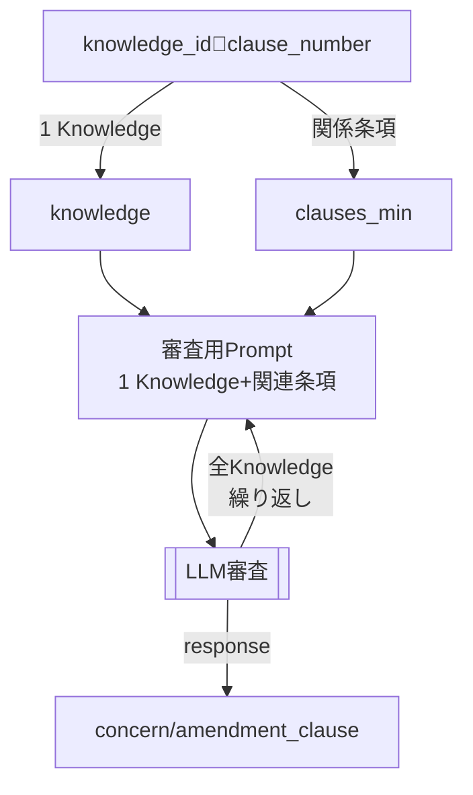
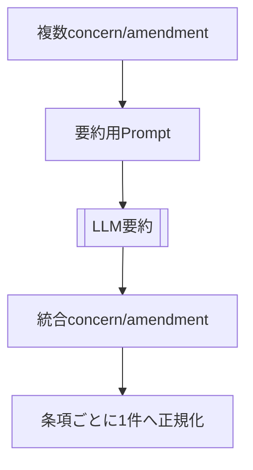

# 技術共有

## 一言で言うと
ナレッジデータを利用したLLMによる契約審査処理と、ナレッジを容易に追加できる

## システムが解く課題
- 審査の再現性: ナレッジに基づく一貫した指摘生成
- ナレッジ再利用: 既存知見の再活用
- 追加容易性: 対話型フローで知見を継続追加

---

## 機能１．契約審査

### 課題
- 「全条項：全ナレッジ」を一発審査処理･･･欠点：トークン数圧迫、コンテキスト肥大化で審査されないナレッジが発生。
- 「１条項：全ナレッジ」･･･欠点／複数条項に渡って審査すべきときに見るべき条項が漏れる。
    - 秘密保持の記載が複数の条項に分割して記載されることがある。
    「ナレッジ例：適切に〇〇が記載されているか？」に対して、関連する「第２条、３条、４条」をまとめて審査すべき。第２条、３条も関係するけど第４条にリスク回避がまとめて書いてあったりする。
- 「１ナレッジ：全条項」･･･欠点／ちょっとでも関係しそうな条項があると重箱の隅を指摘する。
    - フルカスタマイズでマシマシの契約ができてしまう。
    - プロンプトの調整では改善しなかった（無視すべき／指摘すべきのナレッジ別のケース境界を審査用プロプトで同時制御することが困難）
    - 各ナレッジごとに、特にどんな条項を見るべきかを細かく指定したい。

### コンセプト
- ナレッジの関連条項の照会：「１ナレッジ：関連条項」を作る
    - ナレッジに「関連条項の条件」のフィールド追加：無関係条項を除外してコンテキストに入れない
    - １つのナレッジに関連する複数条項を出力（１ナレッジ：関連条項）＝１セット
- 審査
    - 全ナレッジ分のセットを審査プロンプトで繰り返し処理
    - 審査結果付きセットを出力（１ナレッジ：関連条項ｘ審査結果）
- 結果統合
    - 審査結果セットは、１ナレッジに対する複数条項ｘ審査結果で構成
    - 表示は「１条項：審査結果ｘ関連ナレッジ」で表示したい
        ```
        　条項：第１条 XXX
        　結果：〇〇がリスク、△△と▽▽を対策してください。
        　参照ナレッジ：XXX, YYY
        ```
    - １つの条項に対する複数審査結果の形式にデータ正規化、結果をLLMで要約してUI表示

### 入力
- 契約書抽出結果（title/introduction/clauses）
- ナレッジデータ

---

### STEP 1: 照合（`api/async_llm_service.py:amatching_clause_and_knowledge`）
- 目的: `knowledge_id` → `clause_number` の対応付け
- 役割: `SYSTEM_PROMPT` はルール、`USER_PROMPT_TEMPLATE` は入力整形
- 入力縮約: `knowledge_min`（`id`,`target_clause`）/ `clauses`（`clause_number`,`clause`）
- 分割: `clauses` を最大文字数でチャンク化し並列実行
- 厳格出力: JSON配列のみ、曖昧なら `clause_number: []`

**プロンプト短縮版（イメージ）:**
```
SYSTEM: 条項本文とknowledge.target_clauseを照合し、
knowledge_idごとに該当するclause_numberをJSONで返す。

INPUT:
knowledge_min: [{id, target_clause}, ...]
clauses: [{clause_number, clause}, ...]
```

**データサンプル:**
```json
knowledge_min:
[{ "id": "k1", "target_clause": "秘密情報の取扱い" }]
clauses:
[{ "clause_number": "5", "clause": "秘密情報は第三者に開示しない..." },{},{}...]
knowledge_id🔗clause_number:
[{ "knowledge_id": "k1", "clause_number": ["5", "10"] }]
```

**ワークフロー図解:**


---

### STEP 2: 審査（`api/async_llm_service.py:run_batch_reviews`）
- 入力縮約: `clauses_min`（`clause_number`,`clause`）と `knowledge_min`（6項目）を合成
- 審査制約: 指定 `knowledge` 以外を使わない、JSON配列のみ
- 出力JSON: `clause_number`, `concern`, `amendment_clause`, `knowledge_ids`
- 失敗時: 例外は各条項に `LLMエラー` を埋めて継続

**プロンプト短縮版（イメージ）:**
```
SYSTEM: 提供されたknowledgeのみを根拠に、
各clauseの 懸念(concern)と修正案(amendment_clause)をJSONで返す。

INPUT:
clauses_min: [{clause_number, clause}, ...]
knowledge: [{id, target_clause, review_points, action_plan, clause_sample}]
```

**データサンプル:**
```json
clauses_min:
[{ "clause_number": "5", "clause": "秘密情報は第三者に開示しない..." },{}...]
knowledge:
[{ "id": "k1", "target_clause": "秘密情報の取扱い", "knowledge_title": "秘密保持", "review_points": "第三者開示禁止", "action_plan": "開示例外の明記", "clause_sample": "" }]
response:
[{ "clause_number": "5", "concern": "開示例外が未定義", "amendment_clause": "法令等の例外を追記", "knowledge_ids": ["k1"] }]
```

**ワークフロー図解:**


---

### STEP 3: 審査結果の統合（`api/examination_api.py:process_summaries`）
- 対象: 同一条項に複数の `concern` / `amendment_clause` がある場合
- 処理: `api/async_llm_service.py:run_batch_summaries` で統合
- 出力: 1条項につき1件の要約結果に正規化

**プロンプト短縮版（イメージ）:**
```
SYSTEM: 複数の懸念点/修正文案を統合し、簡潔に要約する。

INPUT:
clause_number: "5"
concerns: ["A", "B"]
amendments: ["A修正", "B修正"]
```

**ワークフロー図解:**


### 技術インサイト
> 1. コンテキストを関連条項だけに絞り、LLM入力を最小化して誤検出と負荷を抑制  
> 2. 照合→審査→要約の段階分離で、LLMの役割を明確化  
> 3. 出力を条項単位に再編し、表示と要約の整合性を確保  

---

## 機能２．ナレッジ作成プロンプトフロー

### 課題
- ユーザーから情報を引き出しつつ、最終的に構造化されたJSONを出力したい
- JSONスキーマがユーザーとのやり取りの途中で壊れないようにしたい

### コンセプト
- LLMの出力スキーマ指定の工夫:
  - 対話用のLLMメッセージ `assistant_message` と ステータス管理用JSONを返却スキーマに同梱させ、対話と構造化を同一レスポンスで扱う
- LLMのJSON出力の検証:
  - `FEW_SHOT_TURN` を先頭に置き、期待フォーマットをLLMに固定
  - `TURN_SCHEMA` / `KNOWLEDGE_SCHEMA` でJSON検証
  - `response_format=json_schema` で形式逸脱を抑制し、失敗時は修復リトライ（最大2回）
  - 具体例:
    - NG出力: `knowledge_json` が欠落 / 文字列型になっている
    - 修復後: `knowledge_json: null` を補完し、必須6項目を揃えたJSONで返却

### 入力
- 契約実績
- ユーザーのインプットメッセージ

### 処理内容

**ワークフロー:**
1. ユーザーが参考ドキュメントを添付して会話スタート
2. LLMが添付ファイルから内容把握、足らない情報を確認
3. ユーザーからチャットで情報収集。情報が集まるまで続ける。
4. 収集した情報から生成するナレッジのたたき台を表示。必要なら修正。
5. ナレッジをJson形式で出力

**プロンプト短縮版（イメージ）:**
```
SYSTEM: 
下記のJSON出力ができるようにチャットで情報収集するタスク
- JSONスキーマ指定
- 情報収集フェーズ:
  - Phase 0: 事前分析（入力パターン判定、仮説整理、質問準備）
  - Phase 1: 事実確認（変更点/判断点の合意）
  - Phase 2: 理由の深掘り（リスク/判断基準の言語化）
  - Phase 3: 一般化と適用条件（契約タイプ/トリガー/条件整理）
  - Phase 4: アクション方針（確認行動や条項の修正）
- 不足情報がないかチェック
- Knowledge DBのスキーマに合わせてJSON生成

USER INPUT:
事例/背景/判断 + 添付契約書
```


**LLMレスポンス例（2ターン）:**
```json
// Turn 1
{
  "control": {"schema_version": "1.0", "mode": "interview"},
  "state": {"phase": "collect_case", "missing_info": ["contract_type"]},
  "assistant_message": "こんにちわ！ナレッジ生成をサポートします。契約類型と背景を教えてください。",
  "knowledge_json": null
}
{
  "user_input": "秘密保持契約です。〇〇のようなケースに対応したナレッジを作りたい。"
}
// Turn 2
{
  "control": {"schema_version": "1.0", "mode": "clarify"},
  "state": {"phase": "collect_case", "missing_info": []},
  "assistant_message": "対象条項と懸念点を教えてください。",
  "knowledge_json": null
}
// ...チャットでやり取りして現状把握とナレッジの詳細を詰める...//

// Turn X（完成）
{
  "control": {"schema_version": "1.0", "mode": "finalize"},
  "state": {"phase": "review_knowledge", "missing_info": []},
  "assistant_message": "ナレッジを生成しました。",
  "knowledge_json": {
    "contract_type": "秘密保持",
    "knowledge_title": "開示例外の明確化",
    "target_clause": "秘密情報の取扱い",
    "review_points": "開示例外（法令・裁判所命令等）の有無",
    "action_plan": "例外規定がない場合は追記を依頼",
    "clause_sample": "かくかくしかじか"
  }
}
```

### 技術インサイト
> 1. 会話と状態遷移を同一レスポンスで扱い、対話制御を安定化  
> 2. LLM出力の形式指定と例示で出力揺れを抑制  
> 3. ルール検証→再生成の短い回復で、欠落/型ズレを吸収  
